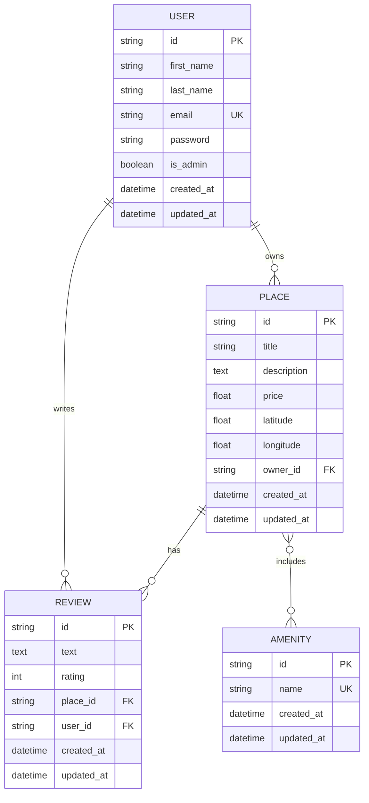

# HBnB Part 3 - Implementation Guide

This document summarizes the implementation of Part 3 with authentication, authorization, and database integration.

## Completed Tasks

### Task 0: Application Factory Configuration ✓
- Updated `config.py` with JWT and SQLAlchemy settings
- Added JWT_SECRET_KEY and database URI configurations for dev/test/prod

### Task 1: Password Hashing ✓
- Added password field to User model
- Implemented bcrypt password hashing in User class
- Updated user endpoints to accept password field
- Passwords are never returned in API responses

### Task 2: JWT Authentication ✓
- Created `/api/v1/auth/login` endpoint for authentication
- Configured Flask-JWT-Extended in application factory
- JWT tokens include user_id, email, and is_admin claims

## Tasks 3-4: Authentication & Authorization

### Implementation Overview
For Tasks 3 and 4, you need to:

1. **Protect endpoints with @jwt_required_custom decorator** (from auth_decorators.py)
2. **Add ownership checks** for places and reviews
3. **Add admin-only operations** with @admin_required decorator

### Endpoints to Secure:

#### User Endpoints
- `POST /api/v1/users/` - PUBLIC (for registration) or ADMIN-ONLY (depends on requirements)
- `PUT /api/v1/users/<id>` - Authenticated user can update OWN profile; Admin can update ANY
- `GET /api/v1/users/` - PUBLIC
- `GET /api/v1/users/<id>` - PUBLIC

#### Place Endpoints
- `POST /api/v1/places/` - AUTHENTICATED users only
- `PUT /api/v1/places/<id>` - Owner or Admin only
- `DELETE /api/v1/places/<id>` - Owner or Admin only
- `GET` endpoints - PUBLIC

#### Review Endpoints
- `POST /api/v1/reviews/` - AUTHENTICATED users only
  - Cannot review own place
  - Cannot review same place twice
- `PUT /api/v1/reviews/<id>` - Review author or Admin only
- `DELETE /api/v1/reviews/<id>` - Review author or Admin only
- `GET` endpoints - PUBLIC

#### Amenity Endpoints
- `POST /api/v1/amenities/` - ADMIN only
- `PUT /api/v1/amenities/<id>` - ADMIN only
- `GET` endpoints - PUBLIC

### Example Implementation Pattern:

```python
from flask_jwt_extended import jwt_required, get_jwt_identity, get_jwt
from app.api.v1.auth_decorators import admin_required, get_current_user_id, is_current_user_admin

@api.route('/')
class PlaceList(Resource):
    @jwt_required()
    @api.doc('create_place')
    def post(self):
        user_id = get_jwt_identity()
        place_data = api.payload
        place_data['owner_id'] = user_id  # Set owner to current user
        # ... create place logic
```

## Tasks 5-8: Database Integration with SQLAlchemy

### Task 5: SQLAlchemyRepository

Create `app/persistence/sqlalchemy_repository.py`:

```python
from flask_sqlalchemy import SQLAlchemy

db = SQLAlchemy()

class SQLAlchemyRepository:
    def __init__(self, model):
        self.model = model

    def add(self, obj):
        db.session.add(obj)
        db.session.commit()

    def get(self, obj_id):
        return self.model.query.get(obj_id)

    def get_all(self):
        return self.model.query.all()

    def update(self, obj_id, data):
        obj = self.get(obj_id)
        if obj:
            for key, value in data.items():
                setattr(obj, key, value)
            db.session.commit()
        return obj

    def delete(self, obj_id):
        obj = self.get(obj_id)
        if obj:
            db.session.delete(obj)
            db.session.commit()
            return True
        return False

    def get_by_attribute(self, attr_name, attr_value):
        return self.model.query.filter_by(**{attr_name: attr_value}).first()
```

### Task 6-8: Model Mapping with SQLAlchemy

#### BaseModel (app/models/base.py):
```python
from app.persistence.sqlalchemy_repository import db
from datetime import datetime
import uuid

class BaseModel(db.Model):
    __abstract__ = True

    id = db.Column(db.String(36), primary_key=True, default=lambda: str(uuid.uuid4()))
    created_at = db.Column(db.DateTime, default=datetime.utcnow, nullable=False)
    updated_at = db.Column(db.DateTime, default=datetime.utcnow, onupdate=datetime.utcnow, nullable=False)
```

#### User Model:
```python
from app.models.base import BaseModel, db
from flask_bcrypt import Bcrypt

bcrypt = Bcrypt()

class User(BaseModel):
    __tablename__ = 'users'

    first_name = db.Column(db.String(50), nullable=False)
    last_name = db.Column(db.String(50), nullable=False)
    email = db.Column(db.String(120), unique=True, nullable=False, index=True)
    password = db.Column(db.String(128), nullable=False)
    is_admin = db.Column(db.Boolean, default=False)

    # Relationships
    places = db.relationship('Place', backref='owner', lazy=True, cascade='all, delete-orphan')
    reviews = db.relationship('Review', backref='user', lazy=True, cascade='all, delete-orphan')
```

#### Place Model:
```python
# Association table for many-to-many relationship
place_amenity = db.Table('place_amenity',
    db.Column('place_id', db.String(36), db.ForeignKey('places.id'), primary_key=True),
    db.Column('amenity_id', db.String(36), db.ForeignKey('amenities.id'), primary_key=True)
)

class Place(BaseModel):
    __tablename__ = 'places'

    title = db.Column(db.String(100), nullable=False)
    description = db.Column(db.Text)
    price = db.Column(db.Float, nullable=False)
    latitude = db.Column(db.Float, nullable=False)
    longitude = db.Column(db.Float, nullable=False)
    owner_id = db.Column(db.String(36), db.ForeignKey('users.id'), nullable=False)

    # Relationships
    reviews = db.relationship('Review', backref='place', lazy=True, cascade='all, delete-orphan')
    amenities = db.relationship('Amenity', secondary=place_amenity, backref='places')
```

#### Review and Amenity Models:
```python
class Review(BaseModel):
    __tablename__ = 'reviews'

    text = db.Column(db.Text, nullable=False)
    rating = db.Column(db.Integer, nullable=False)
    place_id = db.Column(db.String(36), db.ForeignKey('places.id'), nullable=False)
    user_id = db.Column(db.String(36), db.ForeignKey('users.id'), nullable=False)

class Amenity(BaseModel):
    __tablename__ = 'amenities'

    name = db.Column(db.String(50), unique=True, nullable=False)
```

### Initialize Database in App Factory:
```python
from app.persistence.sqlalchemy_repository import db

def create_app(config_name='development'):
    # ... existing code ...

    # Initialize SQLAlchemy
    db.init_app(app)

    with app.app_context():
        db.create_all()  # Create tables

    return app
```

## Task 9: SQL Scripts

### Database Schema (part3/database_schema.sql):
```sql
-- Users table
CREATE TABLE users (
    id VARCHAR(36) PRIMARY KEY,
    first_name VARCHAR(50) NOT NULL,
    last_name VARCHAR(50) NOT NULL,
    email VARCHAR(120) UNIQUE NOT NULL,
    password VARCHAR(128) NOT NULL,
    is_admin BOOLEAN DEFAULT FALSE,
    created_at DATETIME DEFAULT CURRENT_TIMESTAMP,
    updated_at DATETIME DEFAULT CURRENT_TIMESTAMP ON UPDATE CURRENT_TIMESTAMP,
    INDEX idx_email (email)
);

-- Places table
CREATE TABLE places (
    id VARCHAR(36) PRIMARY KEY,
    title VARCHAR(100) NOT NULL,
    description TEXT,
    price FLOAT NOT NULL,
    latitude FLOAT NOT NULL,
    longitude FLOAT NOT NULL,
    owner_id VARCHAR(36) NOT NULL,
    created_at DATETIME DEFAULT CURRENT_TIMESTAMP,
    updated_at DATETIME DEFAULT CURRENT_TIMESTAMP ON UPDATE CURRENT_TIMESTAMP,
    FOREIGN KEY (owner_id) REFERENCES users(id) ON DELETE CASCADE,
    INDEX idx_owner (owner_id)
);

-- Reviews table
CREATE TABLE reviews (
    id VARCHAR(36) PRIMARY KEY,
    text TEXT NOT NULL,
    rating INTEGER NOT NULL CHECK (rating >= 1 AND rating <= 5),
    place_id VARCHAR(36) NOT NULL,
    user_id VARCHAR(36) NOT NULL,
    created_at DATETIME DEFAULT CURRENT_TIMESTAMP,
    updated_at DATETIME DEFAULT CURRENT_TIMESTAMP ON UPDATE CURRENT_TIMESTAMP,
    FOREIGN KEY (place_id) REFERENCES places(id) ON DELETE CASCADE,
    FOREIGN KEY (user_id) REFERENCES users(id) ON DELETE CASCADE,
    UNIQUE KEY unique_user_place (user_id, place_id),
    INDEX idx_place (place_id),
    INDEX idx_user (user_id)
);

-- Amenities table
CREATE TABLE amenities (
    id VARCHAR(36) PRIMARY KEY,
    name VARCHAR(50) UNIQUE NOT NULL,
    created_at DATETIME DEFAULT CURRENT_TIMESTAMP,
    updated_at DATETIME DEFAULT CURRENT_TIMESTAMP ON UPDATE CURRENT_TIMESTAMP
);

-- Place-Amenity junction table (many-to-many)
CREATE TABLE place_amenity (
    place_id VARCHAR(36) NOT NULL,
    amenity_id VARCHAR(36) NOT NULL,
    PRIMARY KEY (place_id, amenity_id),
    FOREIGN KEY (place_id) REFERENCES places(id) ON DELETE CASCADE,
    FOREIGN KEY (amenity_id) REFERENCES amenities(id) ON DELETE CASCADE
);
```

### Initial Data (part3/seed_data.sql):
```sql
-- Insert admin user (password: admin123)
INSERT INTO users (id, first_name, last_name, email, password, is_admin, created_at, updated_at)
VALUES (
    UUID(),
    'Admin',
    'User',
    'admin@hbnb.com',
    '$2b$12$LQv3c1yqBWVHxkd0LHAkCOYz6TtxMQJqhN8/LewY5lW4T4EfToZVi',  -- bcrypt hash of 'admin123'
    TRUE,
    NOW(),
    NOW()
);

-- Insert common amenities
INSERT INTO amenities (id, name, created_at, updated_at) VALUES
(UUID(), 'WiFi', NOW(), NOW()),
(UUID(), 'Swimming Pool', NOW(), NOW()),
(UUID(), 'Air Conditioning', NOW(), NOW()),
(UUID(), 'Kitchen', NOW(), NOW()),
(UUID(), 'Parking', NOW(), NOW()),
(UUID(), 'TV', NOW(), NOW()),
(UUID(), 'Gym', NOW(), NOW()),
(UUID(), 'Pet Friendly', NOW(), NOW());
```

## Task 10: ER Diagram

Create `part3/database_diagram.md`:



## Testing the Implementation

### 1. Create Admin User
```bash
curl -X POST http://localhost:5000/api/v1/users/ \
  -H "Content-Type: application/json" \
  -d '{
    "first_name": "Admin",
    "last_name": "User",
    "email": "admin@hbnb.com",
    "password": "admin123"
  }'
```

### 2. Login to Get JWT Token
```bash
curl -X POST http://localhost:5000/api/v1/auth/login \
  -H "Content-Type: application/json" \
  -d '{
    "email": "admin@hbnb.com",
    "password": "admin123"
  }'
```

### 3. Use Token for Protected Endpoints
```bash
curl -X POST http://localhost:5000/api/v1/places/ \
  -H "Content-Type: application/json" \
  -H "Authorization: Bearer YOUR_JWT_TOKEN" \
  -d '{
    "title": "Beautiful Beach House",
    "description": "Amazing ocean view",
    "price": 150.0,
    "latitude": 34.0522,
    "longitude": -118.2437
  }'
```

## Next Steps

1. Implement JWT decorators on all endpoints as described above
2. Add ownership validation logic in place and review endpoints
3. Test all authentication and authorization flows
4. Verify database persistence with SQLAlchemy
5. Run SQL scripts to set up production database
6. Deploy with proper environment variables

## Important Notes

- Always use environment variables for SECRET_KEY and JWT_SECRET_KEY in production
- Ensure password hashing is working correctly
- Test all authorization rules thoroughly
- Validate input data to prevent injection attacks
- Use proper error handling for all edge cases
